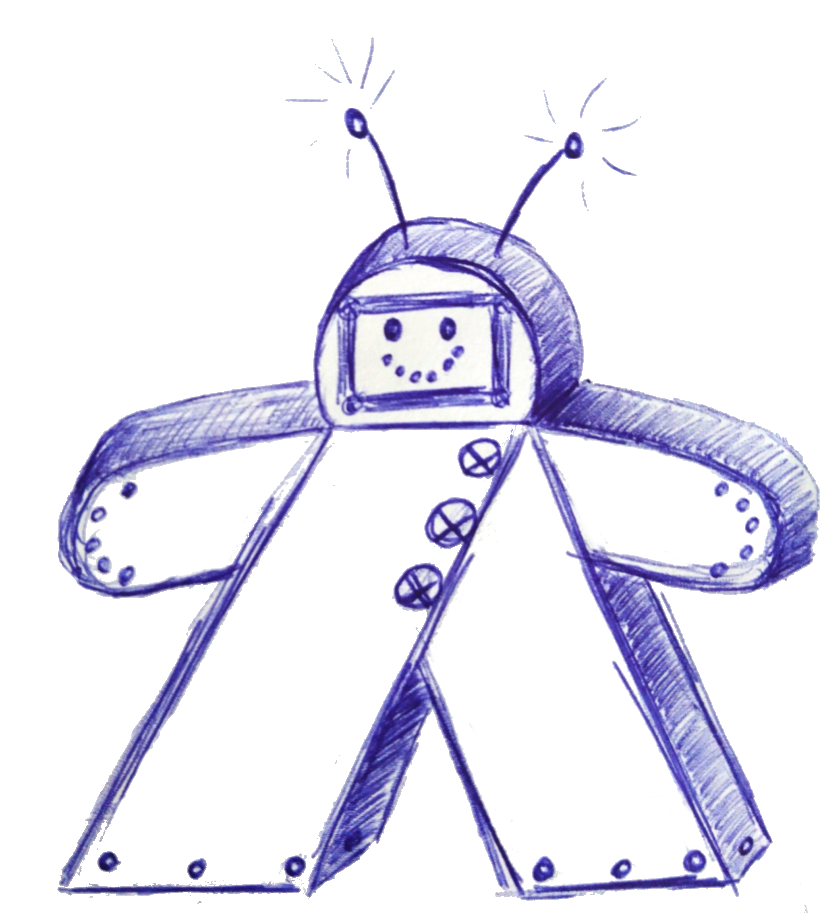

# Boardgame-Bot




This is a Boardgame Bot under construction.

It allows a group of friends who like to play boardgames to (potentially) over-engineer their organization: Users can tell the bot which boardgames (and expansions) they own, they can set up a date for game night and then sign up for it. And the best part: You'll never have to discuss what to play again! When everyone feels ready, the bot can randomly select four games from everyone attending game night (making sure that you're not too many people for it) and generate a poll where every participant gets one vote.
We are planning on implementing a smarter game selection algorithm, but for now, we've been quite happy with this.

This is already version 2 of this idea: Our first boardgame bot was based on a GoogleSpreadsheet structure with gscript code. That old Code can be found in the OLD-GScript folder, so if for some reason you prefer that to a database and Python... Go for it. If you need any help understanding the structure, feel free to ask.

The current code can be found in [src](src/). The structure should be quite obvious, but just a few hints:

* [test.py](src/test.py) is not an actual test file, it is used for isolating code that needs debugging.
* [filters.py](src/filters.py) holds our own filters inherited by the BaseFilter class in the python-telegram-bot library

## Prerequisites

If you want to test the code locally feel free to do so but you have to meet the requirements:

    - Python 3.xx 
    - python-telegram-bot
    - maria-db environment

Instructions can be found below.

## Quick Start 

To get started locally I recommend not just installing python3
but also to use an IDE that helps with formatting and testing.

For this reason I use [**PyCharm**](https://www.jetbrains.com/pycharm/).

The Coding-Style is [**PEP8**](https://www.python.org/dev/peps/pep-0008/).

### Dependencies

To install the [Telegram Bot Framework](https://python-telegram-bot.org/), pip should also be installed:

```shell
sudo apt-get install python3-pip
pip3 install python-telegram-bot
```

Afterwards you may test whether everything is working by executing inside an Python Environment:

``` Shell
import telegram.ext
```

~~And that's it!~~

Almost... for the integration of the database you need mysql connector:
```
pip3 install mysql-connector
```

### Get your own Telegram Bot!

Have a chat with the BotFather and create your own bot. 
If you don't know what I mean by that, have a look here: [Bots: An introduction for developers](https://core.telegram.org/bots#botfather)
The Botfather is going to give you a token for your bot. Hold on to that, you're going to need it!

### Configuration

Enjoy the comfort of an interactive approach on configuration by running ``./configure``.
Or, if you don't like being asked helpful questions by your CLI, here's your guide to DIY:

There is two configuration files you will need to take care of: [config.ini](config.ini.example) and [infrastructure/.env](infrastructure/.env.example). The latter is important for the Docker setup and will be dealt with later. For now,
find [config.ini.example](config.ini.example) and rename your local copy of it to 'config.ini'. 
Then, modify the values held within:

#### Bot
This is where you enter the token the Botfather gave you.

#### Authentication
Think of a nice password. When other people try to talk to your bot (it's publicly visible in the Telegram Botverse), they'll have to know this password in order to do anything useful with it - including accessing your databases.

#### MySQL
All these are values that you will need to access the database(s). Just complete/modify them!

### Docker setup

Our databases run in Docker containers. To set them up, please refer to [infrastructure/README.md](infrastructure/README.md). 

If that didn't throw any errors, you now have a database structure like the one described in [database_structure.md](database_structure.md).
Have a closer look at it if you are not entirely sure what you just did!


### Your Telegram Group
You will need a group to use the full functionality of this bot. While creating a group in Telegram is quite straight-forward, there are a few things to keep in mind:

* For full functionality, give your bot administrator rights.
* Do not check the "All members are administrators" option. You can still make every member an administrator, just don't do it this way.
* Your group should be a supergroup if you want full functionality. 
* All your members should have their Telegram alias configured. This is how they are identified as unique users by the bot.

And there you go, you are now all set up and may start working on our lovely bot!
